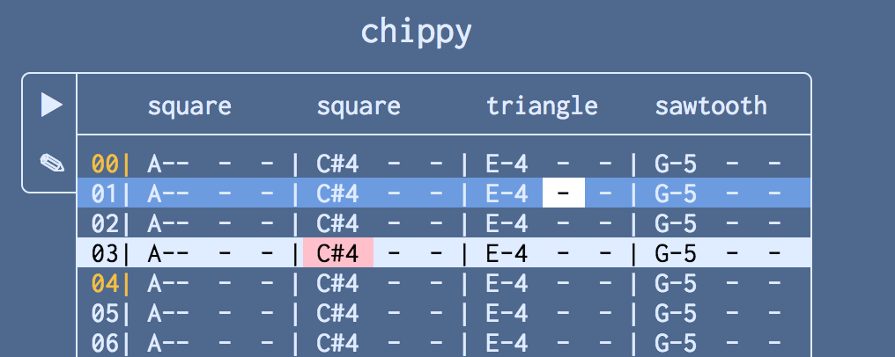

## Chippy
Very WIP in-browser chiptune tracker.

Proof of concept playback and modal editing are available,
but missing some things like action repetition, yank/put,
undo/redo, visual mode, effects... (this is TODO, by the way)

You can try it out with `lein cljsbuild once min`, after which
you can open `resources/public/index.html` to see a little demo.
(TODO: put nightly on github.io)

You can try working on it with this:
```
$ lein repl
$ # once the repl starts:
user=> (lets-go) ;; starts figwheel and a cljs repl
```

(Yeah, I know all the namespace say chipper right now)

### Controls
#### Normal Mode
| Key                  | Effect                          |
|----------------------|---------------------------------|
| `hjkl/←↓↑→`          | left, down, up, right one space |
| `w/b (Tab/Shift+Tab)`| right/left one channel          |
| `g/G`                | got to first/last line          |
| `0/$`                | go to first/last channel        |
| `x`                  | delete note under cursor        |
| `i`                  | switch to insert mode           |

#### Insert Mode
| Key                  | Effect                          |
|----------------------|---------------------------------|
| `a..j`               | enter notes C..B                |
| `w..u/Shift+a..j`    | enter accidentals               |
| `x`                  | enter rest                      |
| `Backspace`          | delete above cursor             |
| `Escape`             | switch to normal mode           |

TODO: octave changes, volume controls

#### Progress milestones:

Jan-18: selection is unfucked, still needs some optimization:

